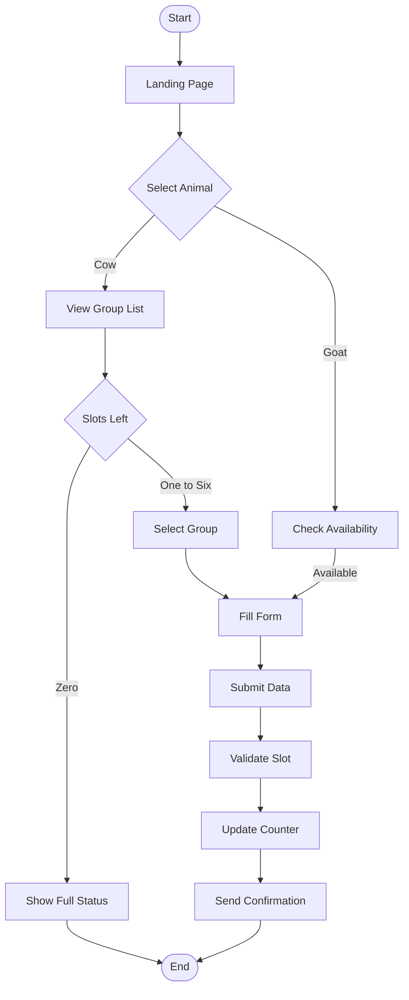
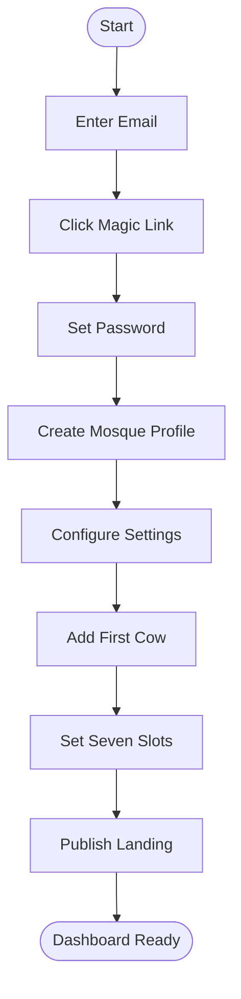
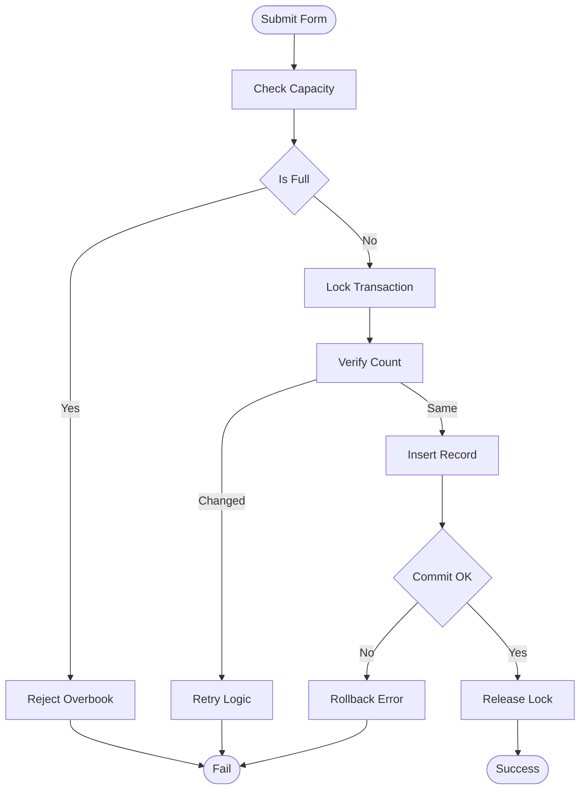

# Patungan Kurban - Product Requirements Document

## 1. Executive Summary

### Problem Statement
Current Qurban management in Indonesian mosques relies on manual ledger books or Excel spreadsheets, creating data silos where only committee members know slot availability. With 50-200 participants annually per mosque, panitia face 15-20 WhatsApp inquiries daily about "slot sapi masih tersisa berapa," causing 5+ hours/week of administrative overhead. This opacity leads to suboptimal group fillings—only 60% of cow groups reach exactly 7 participants (ideal syariah compliance), while 25% remain underfilled and 15% risk overbooking due to race conditions in manual recording. The lack of real-time transparency prevents self-service registration and creates coordination bottlenecks during peak season (H-30 to H-1 Idul Adha).

### Proposed Solution
Patungan Kurban is a web-based transparency platform featuring a public landing page with auto-refreshing slot counters (updated hourly) and a strict 7-slot validation engine for cow groups. Unlike generic donation platforms, it enforces syariah-compliant capacity limits through database transactions that prevent overbooking, while providing visual indicators ("Tersisa 2 slot") to drive urgency and optimal group completion.

### Success Criteria

| Metric | Target | Timeframe |
|--------|--------|-----------|
| Optimal Group Fill Rate | 95% groups reach exactly 7 participants | End of Qurban season (H-1 Idul Adha) |
| Admin Time Reduction | 80% decrease in manual data management | 2 weeks post-launch |
| Self-Service Conversion | 70% registrations via form without WhatsApp inquiry | Throughout registration period |
| Overbooking Incidents | 0 cases of exceeding 7-person limit | Entire campaign duration |
| Data Sync Accuracy | 100% landing page reflects database within 1 hour | Real-time monitoring |

## 2. User Experience & Functionality

### User Personas

**Persona 1: Pak Ahmad (Mosque Treasurer)**
- **Background:** 48-year-old administrator at Masjid Nurul Huda, managing Qurban programs for 8 years. Comfortable with WhatsApp but struggles with Excel formulas. Responsible for collecting $15,000+ in Qurban funds annually from 150+ participants.
- **Goals:** Ensure every cow group hits exactly 7 participants for syariah validity; reduce repetitive WhatsApp inquiries; generate reports for mosque board meetings.
- **Pain Points:** Nightmare of overbooking due to simultaneous verbal commitments; difficulty tracking which of 20 cow groups still need 1-2 people; handwriting illegibility in traditional ledger books causing disputes.

**Persona 2: Sarah (Young Professional Participant)**
- **Background:** 29-year-old marketing manager in Jakarta, first-time Qurban participant via office mosque. Tech-savvy, expects Grab/Gojek-level convenience in religious services. Earns Rp 15M/month and views Qurban as mandatory financial worship.
- **Goals:** Quickly find available cow slots without awkward WhatsApp chats; transparently see group progress (3/7 filled); secure payment confirmation with digital receipt.
- **Pain Points:** Previous year waited 3 days for WhatsApp reply about slot availability, missed opportunity; anxiety about whether her name was correctly recorded by panitia; no visibility into whether group reached 7 people before Eid.

### User Stories

| ID | As a... | I want to... | So that... | Priority |
|----|---------|--------------|------------|----------|
| US-01 | Potential Participant | see real-time slot availability for cow groups | I can choose groups with 1-2 vacancies without contacting panitia | P0 |
| US-02 | Committee Member | add participants to specific cow groups with strict validation | I ensure no group exceeds 7 people (syariah compliance) | P0 |
| US-03 | Committee Head | receive alerts when groups have only 1-2 slots remaining | I can actively campaign to fill them before deadline | P1 |
| US-04 | Participant | register via self-service form linked to available slots | I can secure my spot at midnight without waiting for business hours | P0 |
| US-05 | Treasurer | export participant data to Excel/CSV | I can submit financial reports to mosque board and tax authorities | P1 |

### Core Features

| Feature | Description | Priority | Effort |
|---------|-------------|----------|--------|
| Real-Time Landing Page | Public page showing slot counters with auto-refresh every 60 minutes, visual indicators for urgent groups (1-2 slots left) | P0 | M |
| 7-Slot Validation Engine | Database-level constraint ensuring exactly 7 participants per cow group, with transaction locking to prevent race conditions | P0 | H |
| Self-Service Registration Form | Dynamic form showing only available groups, integrated with slot validation, auto-updating counters upon submission | P0 | M |
| Admin Dashboard CRUD | Full management interface with search, filter, bulk edit, and participant transfer between groups for last-minute changes | P0 | M |
| Slot Alert System | Automated notifications (email/WhatsApp) to admin when groups reach 5/6 participants (threshold alerts) | P1 | L |
| Multi-Animal Management | Separate workflows for individual goats/sheep (1 slot) vs. communal cows (7 slots) with distinct validation rules | P0 | M |
| Data Export Module | One-click download to Excel/CSV with formatted columns for mosque documentation and Baznas reporting | P1 | L |
| Mobile-Responsive Design | Optimized dashboard for smartphone access by panitia who manage data in the field | P0 | M |

### Non-Goals
- **Payment Gateway Integration:** v1 will not handle online payments; focus purely on slot management and registration. Payments remain manual transfer/confirmation.
- **Native Mobile Apps:** No iOS/Android development; Progressive Web App (PWA) capability only.
- **Multi-Mosque Networks:** Single-tenancy per mosque instance; no centralized platform connecting multiple mosques.
- **Automatic Animal Procurement:** No integration with slaughterhouses or livestock suppliers.
- **AI Chatbot Support:** No automated WhatsApp bot; manual inquiry routing only.

## 3. User Flows

### 3.1 Primary User Flow
Visitor discovers available Qurban slots, selects appropriate group, and completes self-registration with real-time validation.

### 3.2 Onboarding Flow
New mosque committee registers platform account, configures their mosque profile, and initializes first Qurban groups.

### 3.3 Error & Edge Case Flow
System handles race conditions when multiple users simultaneously attempt to book final available slots.

## 4. Technical Specifications

### Architecture Overview
Patungan Kurban utilizes a monolithic full-stack Next.js 14 architecture with App Router, leveraging Server Components for initial data hydration and Client Components for hourly polling updates. PostgreSQL handles ACID-compliant transactions to enforce the strict 7-person cow group constraint, preventing race conditions through row-level locking during concurrent registrations.

### Tech Stack

| Layer | Technology | Rationale |
|-------|-----------|-----------|
| Frontend | Next.js 14 App Router + Tailwind CSS + shadcn/ui | SEO-friendly landing pages for mosque discoverability; responsive mobile dashboard for panitia field access |
| State Management | TanStack Query (React Query) | Polling interval 3600000ms (1 hour) for real-time slot updates without WebSocket complexity |
| Backend | Next.js API Routes + Server Actions | Single codebase reduces maintenance for non-technical mosque volunteers; type-safe CRUD operations |
| Database | PostgreSQL via Supabase | ACID compliance for 7-slot constraints; Row Level Security (RLS) for data protection; free tier sufficient for 200 annual users |
| Auth | Supabase Auth | Magic Link email authentication eliminates password management burden for elderly panitia |
| Hosting | Vercel + Supabase | Edge network in Singapore ensures <100ms latency for Indonesian users; automatic GitHub deployment |

### Integration Points

| System | Purpose | Protocol |
|--------|---------|----------|
| WhatsApp Business API | Slot alert notifications to committee | REST API via Twilio or Wablas |
| SendGrid/Resend | Transactional emails for registration confirmations | SMTP/API |
| SheetJS | Excel/CSV export for mosque reporting | Client-side library |

### Security & Privacy
- **Authentication:** Magic Link email authentication with 24-hour expiry; optional TOTP for treasurer accounts.
- **Authorization:** PostgreSQL RLS policies ensuring participants can only view their own data; public read-only access to slot counters only.
- **Encryption:** TLS 1.3 for data in transit; AES-256 for database backups.
- **Compliance:** UU PDP (Personal Data Protection) compliance for Indonesian donor data; no storage of banking credentials; syariah validation review by mosque Dewan Syariah before deployment.

### Performance Requirements
- **Page Load:** <800ms for landing page (p95), measured via Vercel Analytics
- **API Response:** <400ms for slot availability queries (p95)
- **Uptime:** 99.9% during Qurban season (H-60 to H-1), with status page monitoring
- **Concurrent Users:** Support 50 simultaneous form submissions without race condition errors

## 5. Success Metrics & KPIs

**Acquisition**
- **Landing Page Traffic:** 500 unique visitors during H-30 to H-1 period (representing 2.5x target participant base of 200)
- **Registration Conversion Rate:** 70% of visitors complete registration without WhatsApp inquiry

**Engagement**
- **Dashboard Active Users:** 100% of committee members (avg 3-5 users) access dashboard weekly during campaign
- **Self-Service Ratio:** 85% of total registrations originate from public form vs. manual admin entry

**Retention**
- **Reactivation Rate:** 90% of previous year participants return to platform next Qurban season (measured Year 2)
- **Data Accuracy:** Zero manual reconciliation errors between digital records and actual slaughter execution

**Operational Efficiency**
- **Time Savings:** 80% reduction in administrative hours (from 5 hours/week to <1 hour/week)
- **Query Reduction:** 75% decrease in "slot availability" WhatsApp messages compared to previous manual system

## 6. Implementation Roadmap

### Phase 1 — MVP (H-60 to H-45 before Idul Adha)
**Features:** Real-time landing page with hourly refresh, 7-slot validation engine, basic CRUD dashboard, self-service registration form, mobile-responsive design.
**Milestone:** Soft launch with 20 test participants from mosque internal committee; zero overbooking incidents during testing.

### Phase 2 — Growth (H-45 to H-30 before Idul Adha)
**Features:** WhatsApp alert integration for slot notifications, Excel/CSV export module, email confirmation system, duplicate participant detection, waitlist functionality for full groups.
**Milestone:** Full public launch; 50% of target participants registered via self-service.

### Phase 3 — Scale (H-30 to H-7 before Idul Adha)
**Features:** Advanced analytics dashboard (fill rates by group), bulk import for large mosque databases, backup/sync verification tools, printer-friendly group manifests for slaughter day.
**Milestone:** 95% optimal fill rate achieved; system handling peak traffic of 100 concurrent users.

## 7. Risks & Mitigations

| # | Risk | Impact | Likelihood | Mitigation |
|---|------|--------|------------|------------|
| 1 | Senior panitia resistance to digital tools | High (adoption failure) | Medium | Provide printed QR codes linking to landing page; maintain hybrid manual backup for first year; conduct 2-hour hands-on training session |
| 2 | Race condition overbooking on final slots | High (syariah compliance failure) | Medium | Implement database transaction locking with SELECT FOR UPDATE; add optimistic locking retry logic; display "Reserving..." state during submission |
| 3 | Traffic spike crash H-7 before Eid | High (reputation damage) | High | Enable Vercel Edge caching for landing page; database connection pooling; load testing with 200 concurrent users before H-30 |
| 4 | Data privacy breach (UU PDP violation) | High (legal/financial) | Low | Supabase RLS policies; encrypt PII at rest; conduct penetration testing; obtain mosque board legal clearance |
| 5 | Incorrect syariah implementation (7 persons rule) | Critical (religious validity) | Low | Review by Dewan Syariah mosque before launch; clear UI labeling "Maksimal 7 orang sesuai syariat"; hard database constraint preventing 8th entry |

---

**Document Version:** 1.0  
**Last Updated:** April 2026  
**Owner:** Product Management Team  
**Stakeholders:** Engineering, Customer Success, Finance, Operations